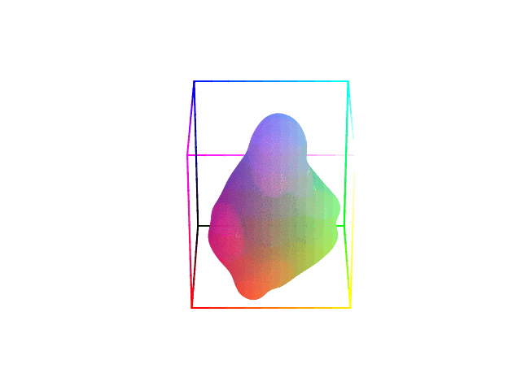

# NOCS Renderer

## NOCS Cube around a Mesh Object - simple live renderer
`python plot_nocs.py`

## NOCS Cube around a Mesh Object - GIF rendering of multiple frames 
`python plot_nocs_gif.py`

## Rendering the CAMERA dataset of the [NOCS paper](https://github.com/hughw19/NOCS_CVPR2019)
download meshes:  
`wget http://download.cs.stanford.edu/orion/nocs/obj_models.zip`  
render full CAMERA dataset:  
`bash render_camera_dataset.sh` or single object only:  
`python render_nocs_dataset.py <obj_folder_name> <meshes_folder> <output dir>`  
`python render_nocs_dataset.py 02876657 /hdd2/real_camera_dataset/obj_models/train /hdd2/nocs_category_level`  

## Rendering NOCS Maps of a BOP dataset:
`python render_bop_dataset.py <bop_directory> <dataset>`

